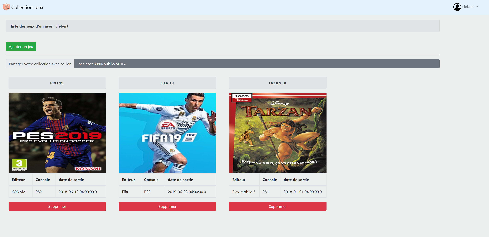
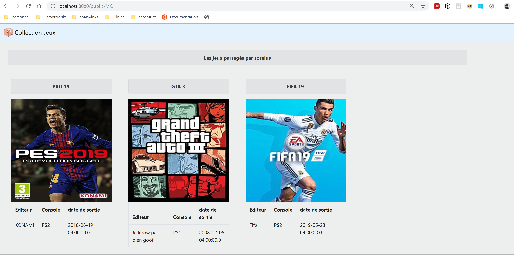

TP2 TEST DE VALIDATION DES ACQUIS
=================

Outils de developpement
-----------------
 * Maven 3
 * Java 8 (spring boot version 2.0 (Spring Framework 5))
 * Mysql 5.6

Compilation et execution du projet
-----------------

* Installer java (jdk 8)

* Installer Maven 3 ( >3.2)

* Installer Mysql 5.6
    * Creer une DB : games_db
    * Creer un utilsateur avec des access complets sur cette DB 
   
    <b>user </b>: admin
     
    <b>pass </b> :sorelus50 
     
    Vous pouvez configurer les access DB à utiliser par l'application depuis le fichier : <i>sorelTP2/src/main/resources/application.properties</i> 
    
    
* Compilation
	* cd sorelTP2
	* mvn clean package

* Executer
	* java -jar target/sorel.tp2-0.0.6.war
	* Ouvrez le navigateur et entrez http://localhost:8080
	
Comment ça fonctionne
-----------------
* Ouvrir la page : http://localhost:8080
* Cliquez sur <b><i>creer un compte</i></b>
* Creez vos comptes (il existe 2 types de compte : admin et simple)
    * Le compte <b>admin</b> vous donne la possibilité de creer des consoles, des jeux. ces entités pourrons etre utilisées par les utilisateurs simples ( compte simple), creer et editer des utilisateurs.
    * Le compte <b> simple</b> est le compte basique , avec ce compte , on peut creer et manager (ajouter / supprimer) sa collection de jeux ( jeux prealablement crées par un admin) .
    
Nouvelles fonctions
 -----------------  
 * La liste des jeux d'une collection s'affiche avec des jaquettes de jeux.

* Vous pouvez partager votre collection avec n'importe qui , grace au lien de partage.

